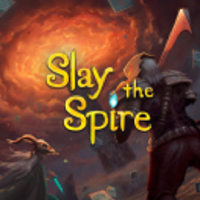
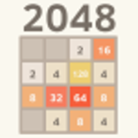

# Orak 🎮

**Orak (오락)** is a _foundational_ benchmark for evaluating Large Language Model (LLM) agents in diverse popular video games. Please check out our [paper](https://arxiv.org/pdf/2506.03610) and the [leaderboard](https://krafton-ai.github.io/orak-leaderboard/) for more details!

> *The name **Orak** comes from **오락 (orak)**, the native Korean word meaning "game".


by [Dongmin Park](https://scholar.google.com/citations?user=4xXYQl0AAAAJ&hl=ko)<sup>1*</sup>, [Minkyu Kim](https://scholar.google.com/citations?user=f-kVmJwAAAAJ&hl=ko)<sup>1*</sup>, [Beongjun Choi](https://scholar.google.com/citations?user=Epg7D2QAAAAJ&hl=ko)<sup>1*</sup>, [Junhyuck Kim](https://scholar.google.com/citations?user=f-kVmJwAAAAJ&hl=ko)<sup>1</sup>, [Keon Lee](https://scholar.google.co.kr/citations?user=V9uj_6cAAAAJ&hl=ko)<sup>1</sup>, [Jonghyun Lee](https://scholar.google.com/citations?user=GPi5hw4AAAAJ&hl=ko)<sup>1</sup>, [Inkyu Park](https://scholar.google.com/citations?user=83gYStYAAAAJ&hl=ko)<sup>1</sup>, [Byeong-Uk Lee](https://scholar.google.co.kr/citations?user=0ISM7DsAAAAJ&hl=en)<sup>1</sup>, [Jaeyoung Hwang](https://scholar.google.com/citations?user=f-kVmJwAAAAJ&hl=ko)<sup>1</sup>, [Jaewoo Ahn](https://scholar.google.com/citations?user=tQiOa1cAAAAJ&hl=ko)<sup>1,2</sup>, [Ameya S. Mahabaleshwarkar](https://scholar.google.com/citations?user=LIAWNdcAAAAJ&hl=en)<sup>3</sup>, [Bilal Kartal](https://scholar.google.com/citations?user=Q9hKzEwAAAAJ&hl=en)<sup>3</sup>, [Pritam Biswas](https://github.com/Pritam-Biswas)<sup>3</sup>, [Yoshi Suhara](https://scholar.google.it/citations?user=tjWt_1MAAAAJ&hl=en)<sup>3</sup>, [Kangwook Lee](https://scholar.google.co.kr/citations?user=sCEl8r-n5VEC&hl=ko)<sup>1,4</sup>, [Jaewoong Cho](https://sites.google.com/view/jaewoongcho)<sup>1</sup>.

<sup>1</sup> [KRAFTON AI](https://www.krafton.ai/en/research/publications/), <sup>2</sup> Seoul National University, <sup>3</sup> NVIDIA, <sup>4</sup> University of Wisconsin-Madison


## Table of Contents

1. [Features](#features)  
2. [Project Structure](#project-structure)
3. [Installation](#installation)
4. [Evaluation](#evaluation)
5. [Agent Module Study](#run-your-custom-script)
6. [Bonus: Freeform Gameplay with Claude](#bonus-freeform-gameplay-with-claude-via-mcp)
7. [Submission Guideline](#submission-guideline)

## Features

- Cover most game genres with 12 popular titles — see [full game list](#game-list)
- Enable plug-and-play studies of agentic modules via the [Model Context Protocol (MCP)](https://github.com/jlowin/fastmcp) interface
- Support analysis of both LLMs and VLMs on textual and visual game states
- Easily integrate new environments, models, and custom agents with a config-driven setup — see [script customization](#run-your-custom-script)


## Project Structure

### Game List
| Action | Adventure | RPG | Simulation | Strategy | Puzzle | 
|:--:|:--:|:--:|:--:|:--:|:--:|
| [Street Fighter III](https://streetfighter.fandom.com/wiki/Street_Fighter_III:_3rd_Strike) | [Ace Attorney](https://aceattorney.fandom.com/wiki/Phoenix_Wright:_Ace_Attorney) | [Pokémon Red](https://pokemon.fandom.com/wiki/Pok%C3%A9mon_Red_Version_and_Pok%C3%A9mon_Blue_Version) | [Minecraft](https://www.minecraft.net/) | [StarCraft II](https://starcraft2.com/) | [Baba Is You](https://hempuli.com/baba/) |
|  |  |  |  |  |  |
| [Super Mario](https://github.com/Kautenja/gym-super-mario-bros) | [Her Story](https://www.herstorygame.com/) | [Darkest Dungeon](https://www.darkestdungeon.com/) | [Stardew Valley](https://www.stardewvalley.net/) | [Slay the Spire](https://www.megacrit.com/) | [2048](https://play2048.co/) |
|  |  |  |  |  |  |


### Core Modules

<details> 
<summary>MCP structure description</summary>

- `mcp_agent_client/`: Manages interaction between agent modules at mcp_agent_servers and the game environment.
   - Defines a MCP client responsible for managing connections between agent servers and game servers.
   - Implements API functions for multiple LLM instances (e.g., OpenAI's GPT-4o, Meta's Llama-3.2-1B-Instruct).
   - Provides game-independent play logic with a main configuration for managing hyperparameters related to game execution.
- `mcp_agent_servers/`: Implementations of LLM/SLM-based gaming agents.
   - Implements servers (MCP tools) that communicate with the `mcp_agent_client` to support agentic modulation.
   - Defines prompts for each game and agent.
   - Compatible with platform-provided client LLMs (e.g., Claude Desktop) without relying on the APIs defined in `mcp_agent_client`.
- `mcp_game_servers/`: Collection of supported game environments.
   - Implements servers (MCP tools) that communicate with the `mcp_agent_client` to deliver and update game states.
   - Defines environment implementations for each supported game.
   - Compatible with platform-provided client LLMs (e.g., Claude Desktop) without relying on the APIs defined in `mcp_agent_client`.
</details>

## Installation

### 1. Game Setup

Each game must be set up individually following the instructions in `docs/setup_{game}.md`.
Note that, 6 games, _Ace Attorney_, _Her Story_, _Darkest Dungeon_, _Stardew Valley_, _Slay the Spire_, and _Baba Is You_, require a **one-time purchase**, typically priced between $9.99 and $24.99. The other six games are **free-to-play**.

### 2. Python Environment

We support both the MCP script (based on [uv](https://github.com/astral-sh/uv) environment) and Python scripts (based on conda environments). Both scripts invoke the **same** game environment and produce **identical** gameplay results.

<details> 
<summary>MCP version</summary>

uv installation
```bash
powershell -ExecutionPolicy ByPass -c "irm https://astral.sh/uv/install.ps1 | iex" # windows
```

virtual environment creation
```bash
uv venv --python 3.10
.venv/Script/activate # windows
uv pip install -e .
```

default for most games
```bash
uv pip install -r requirements/base.txt
``` 

for some games (_supermario_, etc)
```bash
uv pip install -r requirements/base.txt
uv pip install -r requirements/{game}.txt
```
</details>

<details> 
<summary>Python script version</summary>

default for most games
```bash
conda create -n orak python=3.10
conda activate orak
pip install -r requirements/base.txt
``` 

for some games (_supermario_, etc)
```bash
conda create -n orak python=3.10
conda activate orak
pip install -r requirements/base.txt
pip install -r requirements/{game}.txt
```
</details>

### 3. API Key Setup

To use commercial API-based LLMs (from OpenAI, Anthropic, Google, DeepSeek), create a key file under the `src/mcp_agent_servers/keys/` as follows:

<details> 
<summary>API key details</summary>

- OpenAI
   - create `src/mcp_agent_servers/keys/openai-key/key.env` and add your API key (as a plain text string started with `sk-***`)
- Anthropic
   - create `src/mcp_agent_servers/keys/anthropic-key/key.env` and add your API key (as a plain text string started with `sk-***`)
- Google (current version is for Vertex AI)
   - create `src/mcp_agent_servers/keys/google-key/gemini_gcp.json` and add your GCP JSON service account key.
- DeepSeek
   - create `src/mcp_agent_servers/keys/deepseek-key/key.env` and add your API key (as a plain text string started with `sk-***`)
</details>


## Evaluation

### Leaderboard (Single-player)

1. **Setup the Game Environment**  
   Follow the [Game Environment Setup Guide](#1-game-setup) to configure the required environment.

2. **Launch the Game**  
   Ensure the game is running and ready for interaction. Note that the game will be automatically launched for certain games, e.g., _supermario_ and _2048_. _Note: Some games require minor **manual setup after launch**, so please check the corresponding setup file in `docs/setup_{game}.md` before running_.

3. **Run the Gaming Agent**  

- MCP version
   ```bash
   bash scripts/leaderboard/mcp/{game}.sh
   ```
- python script version
   ```bash
   bash scripts/leaderboard/python/{game}.sh
   ```

### Battle Arena (Two-players)

- MCP version
   ```bash
   bash scripts/arena/mcp/{game}.sh
   ```
- python script version
   ```bash
   bash scripts/arena/python/{game}.sh
   ```

We described the details of evaulation metrics for each game in `docs/eval_metrics.md`.

## Run Your Custom Script

You can easily customize the run script by specifying **<Game, LLM, Agent Module, Input Type>**. This enables studies on agentic strategies and input state types over all games — see [available agent list](./src/mcp_agent_servers/agent_types.py)

- MCP version

   ```bash
   uv run ./scripts/mcp_play_game.py \
      --config ./src/mcp_agent_client/configs/{game}/config.yaml \
         env.input_modality={input_modality} \
         agent.llm_name={model} \
         agent.agent_type={agent} \
         agent.prompt_path=mcp_agent_servers.{game}.prompts.{input_modality}.{agent}
   ```

   Replace `{game}, {model}, {agent}, {input_modality}` with the name of the those you want to run. You can also customize the configuration by changing **<Game, LLM, Agent Module, Input Type>** in `./src/mcp_agent_client/configs/{game}/config.yaml` — see [config details](./docs/configuration.md)

- Python script version

   ```bash
   python scripts/play_game.py --config {config_path} \
      env.input_modality={input_modality} \
      agent.llm_name={model} \
      agent.agent_type={agent} \
      agent.prompt_path=mcp_agent_servers.{game}.prompts.{input_modality}.{agent}
   ```

   Replace `{game}, {model}, {agent}, {input_modality}` with the name of the those you want to run. You can also customize the configuration by changing **<Game, LLM, Agent Module, Input Type>** in `./src/mcp_agent_client/configs/{game}/config.yaml` — see [config details](./docs/configuration.md)

## Bonus: Freeform Gameplay with Claude via MCP

Our MCP interface supports fully free-form, open-ended gameplay beyond standard evaluation with _static_ agentic strategies. The LLM can decide **when and how** to use different tools and prompts during gameplay. For example, you can simply prompt Claude with _"Play the {game} by yourself. {some instructions to use the mcp tools}"_, which allows Claude to take full control of gameplay decisions and tool usage. Below are video examples of Claude actively playing _Ace Attorney_ and _Baba Is You_  — see [claude gameplay guideline](./docs/run_claude.md) for more details

<table>
  <tr>
    <td align="center" width="50%">
      <br>
      <sub><b>Claude playing <i>Ace Attorney</i></b></sub>
    </td>
    <td align="center" width="50%">
      <br>
      <sub><b>Claude playing <i>Baba Is You</i></b></sub>
    </td>
  </tr>
</table>

## Submission Guideline

You can submit your own LLM backbones and agentic strategies to our repo. Please check out the guideline in [docs/submission_guidline.md](./docs/submission_guideline.md). We are also open to the contribution for **adding new games**. If you want to do so, please make the PR or reach out to [dongmin.park@krafton.com](dongmin.park@krafton.com). We will credit your contribution in README.md.


## Citation
```
@article{park2025orak,
  title     = {Orak: A Foundational Benchmark for Training and Evaluating LLM Agents on Diverse Video Games},
  author    = {Park, Dongmin and Kim, Minkyu and Choi, Beongjun and Kim, Junhyuck and Lee, Keon and Lee, Jonghyun and Park, Inkyu and Lee, Byeong-Uk and Hwang, Jaeyoung and Ahn, Jaewoo and Mahabaleshwarkar, Ameya S. and Kartal, Bilal and Biswas, Pritam and Suhara, Yoshi and Lee, Kangwook and Cho, Jaewoong},
  year      = {2025},
  eprint    = {2506.03610},
  archivePrefix = {arXiv},
  note      = {arXiv:2506.03610}
}
```