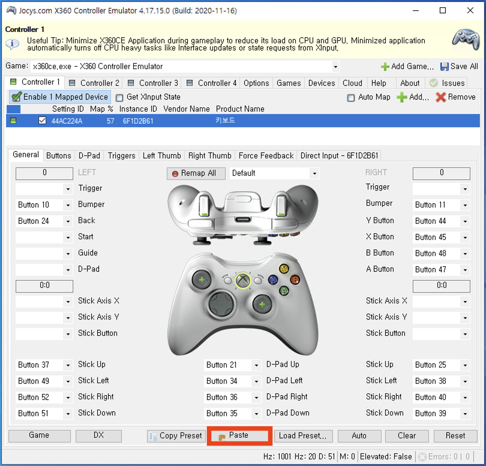

# Darkest Dungeon Setup Guide

*(Only Windows is supported currently.)*

---

## 1. Install the Game
- Download and install [Darkest Dungeon](https://store.steampowered.com/app/262060/Darkest_Dungeon/) from Steam.
- Launch the game at least once.
  - **Important:** Go to **Esc** > **Options** > **Other** and uncheck the **Tutorials** option.


---

## 2. Controller Emulator Setup

### Step 1: Download Emulator
- Visit [x360ce.com](https://www.x360ce.com/) and click **"DOWNLOAD FOR ALL GAMES"** to get the Xbox 360 Controller Emulator.

### Step 2: Configure Controller
1. Launch the Xbox 360 Controller Emulator.
2. Under the **Controller 1** tab, check **"Enable 0 Mapped Devices"**.


3. Click the **Add** (+ icon) button.


4. Mouse and keyboard should be selected by default — click **"Add Selected Device"**.


### Step 3: Import Controller Configuration
1. Open `x360ce.xml` located at `src/gaming_slm/games/darkest_dungeon/utils` using a text editor.
2. Copy the entire contents.


3. In the emulator, click the **"Paste"** button at the bottom to import settings.



4. The emulator window should update to reflect the imported layout.
5. In the emulator, click Issues > Install button.


### Step 4: Minimize
- Minimize the emulator to the system tray while using it.
- Remember to exit the emulator after you're done playing.

---

## 3. Save Editor Installation

### Step 1: Download
- Download [Darkest Dungeon Save Editor v0.0.70](https://github.com/robojumper/DarkestDungeonSaveEditor/releases/tag/v0.0.70).
- Unzip the downloaded file.

### Step 2: Place File
- Move `DDSaveEditor.jar` into:
  `src/gaming_slm/games/darkest_dungeon/utils`

### Step 3: Java Installation
- Ensure Java is installed on your system. You may reboot your system after install.
- Installation link: https://www.oracle.com/java/technologies/downloads/#jdk24-windows

---

## 4. Configuration Setup

1. Open: `configs/darkest_dungeon/darkest_dungeon.yaml`
2. Do **not** change `save_editor_path`.
3. `game_install_location` should be correct by default. To confirm:
   - Open Steam > Right-click **Darkest Dungeon** > **Properties** > **Installed Files** > **Browse**
4. Set `steam_user_id`:
   - Navigate to: `C:\Program Files (x86)\Steam\userdata\`
   - If only one folder exists — that’s your Steam **AccountID**.
   - If multiple, open each and check for a subfolder named `262060` (the App ID for Darkest Dungeon).
5. Set `profile_number`:
   - This corresponds to your in-game profile index (usually `0`, `1`, etc.).


6. For the first run, you should manually generate `game_states` folder in path `src\gaming_slm\games\darkest_dungeon\utils`.

---

## 5. Final Checks Before Running

### Run in Windowed Mode
- The game must run in **windowed** mode.
- Adjust the resolution to **fill the screen closely**, as looting logic relies on screenshot regions.


 ---


# Darkest Dungeon Evaluation Guide

### 1. Close the running game before proceeding

### 2. Download [.zip save file](https://drive.google.com/file/d/1WNIfh4b_0QyCb-kaHk4AuNFVfF_lI3Ii/view?usp=sharing) of Darkest Dungeon

### 3. Unzip the save file and paste in 

`C:\Program Files (x86)\Steam\userdata\YOUR_STEAM_ACCOUNT_ID\262060`
> ⚠️ **Important:** This procedure removes the your save files for the Darkest Dungeon. It is recommended that you cut and move your existing save files from the original directory to a separate, secure location for backup.

### 4. Launch the game and load the GameBench save file located in profile slot number 0


### 5. Press space and confirm that four heroes have arrived at the dungeon.


### 6. Run the evaluation script:
   ```bash
   uv run .\scripts\mcp_play_game.py --config .\src\mcp_agent_client\configs\darkest_dungeon\config.yaml
   ```

### 7. After starting the script, **click back on the game window** to ensure it has focus (so input is captured).

> ✅ Once everything is set up, the evaluation will begin.

> ⚠️ **Darkest Dungeon uses automatic saving**, so to run the evaluation again, you **must restart from step 3** of this guide.
>
> **Important:** If you complete a quest and return to the Hamlet, then overwrite the save file and relaunch the game, the save file may **not load properly** due to how Darkest Dungeon handles save data.
>
> To avoid this issue, follow these steps before reapplying the save file:
>
> 1. After finishing a quest and returning to the Hamlet, **select any hero and embark on any dungeon**.
> 2. **Confirm that you have entered the dungeon**, then fully **exit the game**.
> 3. Proceed to **step 3** again and paste the downloaded save file before restarting the evaluation.
>
> This ensures the save file loads correctly and prevents issues during re-evaluation.