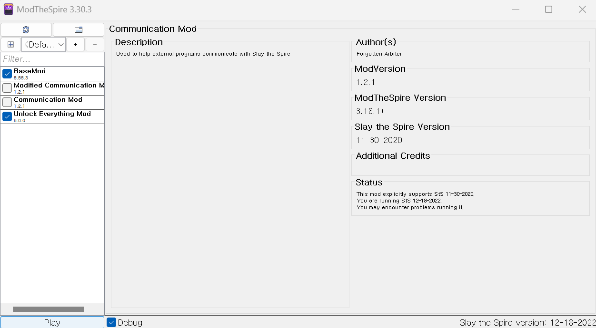
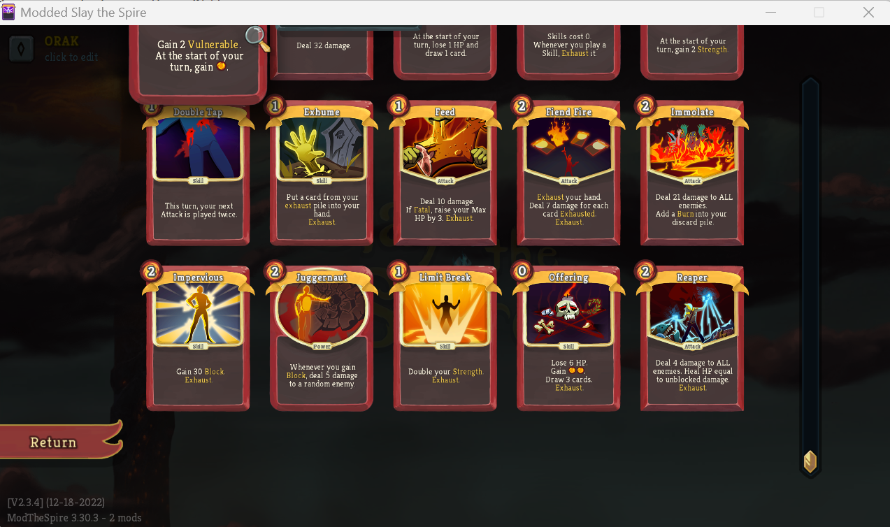
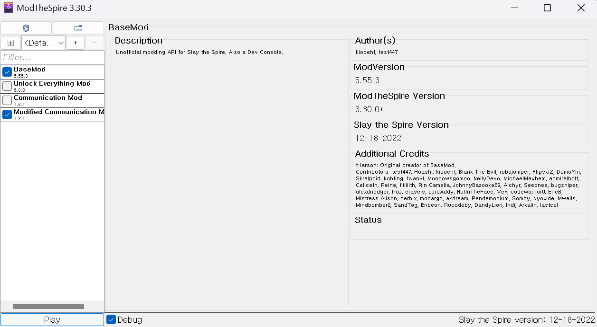

# Slay The Spire Setup Guide

## 1. Install the Game and Modding Tool
- Download and install [Slay The Spire](https://store.steampowered.com/app/646570/Slay_the_Spire/) from Steam.
- From Slay the Spire Workshop in Steam, install "ModTheSpire", "BaseMod", "Unlock Everything" mods.
- Copy [ModifiedCommunicationMod.jar](../executables/slay_the_spire/ModifiedCommunicationMod.jar) to mod path. The mod path is typically located at:
    - Windows: `C:\Program Files (x86)\Steam\steamapps\common\SlayTheSpire\mods`
    - Mac: `~/Library/Application Support/Steam/steamapps/common/SlayTheSpire/SlayTheSpire.app/Contents/Resources/mods`

---

## 2. Prepare Evaluation Setup
- Run game with Unlock Everything Mod enabled. Run multiple runs (~2 runs) and abandon. It will unlock all cards.



- After unlock, all cards in Compendium > Card Library > Red should be available.



- Edit `config.properties` (this file is generated after starting game at least once with ModifiedCommunicationMod enabled).
    - Windows:
        - File path: `C:\Users\minkyu.kim\AppData\Local\ModTheSpire\CommunicationMod\config.properties`
        - Contents: 
            ```
            #Thu May 15 16:39:37 KST 2025
            
            command=cmd /c "C\:\\PATH\\TO\\gamingslm\\scripts\\leaderboard\\python\\slay_the_spire.bat"
            runAtGameStart=true
            ```
    - Mac:
        - File path: `~/Library/Preferences/ModTheSpire/CommunicationMod/config.properties`
        - Contents:
            ```
            #Wed May 14 13:21:44 KST 2025
            command=bash ~/PATH/TO/gamingslm/scripts/leaderboard/python/slay_the_spire.sh
            runAtGameStart=true
            ```

- Modify `scripts/leaderboard/python/play_slay_the_spire.{bat, sh}` corresponding to your path.

## 3. Evaluation

- Evaluation pipeline of Slay the Spire is slightly different from the other games. ModifiedCommunication Mod allow the game process to spawn another process, which can communicate with the game by stdio.
- Therefore, running game with ModifiedCommunicationMod enabled will automatically spawn `scripts/play_game.py` and the evaluation will be progressed.



---
## Note

- Stderr messages are save to a separate file `communication_mod_errors.log` by generated by ModifiedCommunicationMod. It is typically located at:
    - Windows: `C:\Program Files (x86)\Steam\steamapps\common\SlayTheSpire\communication_mod_errors.log`
    - Mac: `~/Library/Application Support/Steam/steamapps/common/SlayTheSpire/SlayTheSpire.app/Contents/Resources/communication_mod_errors.log`

- Vision input is currently supported only on Windows. However, it can be run on macOS with minimal code modifications.

---
## Acknowledgements

This project was made possible thanks to the valuable contributions and inspiration provided by the open-source community. We would like to express our sincere gratitude to the following repositories:

- [Communication Mod](https://github.com/ForgottenArbiter/CommunicationMod) – for enabling robust communication between the game and external processes.
- [Slay The Spire bot](https://github.com/ForgottenArbiter/spirecomm) – for providing a foundational algorithm for automated gameplay.
- And to all contributors involved in modding *Slay the Spire* – your work laid the groundwork.

We deeply appreciate the dedication and effort of the maintainers and contributors of these projects. Their work has been instrumental in shaping and enhancing the development of this repository.
